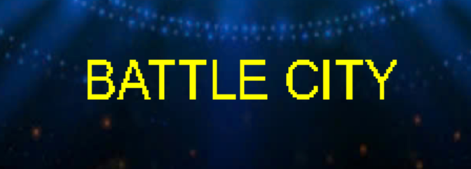
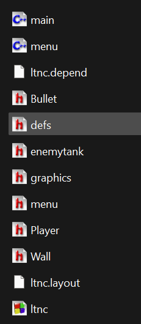

BATTLE TANK: Bài tập tập lập trình nâng cao INT2215

I. Thông tin tác giả
Họ và tên: Lê Trọng Thức
Mã số sinh viên: 24021637
Lớp: K69I - CS1
II. Tổng quan
Thể loại: Action.
Nền tảng: PC.
Ngôn ngữ / Thư viện sử dụng: C++ / SDL2.
Tóm tắt: Battle Tank là một trò chơi hành động bắn súng kết hợp mô phỏng nhẹ, lấy bối cảnh Thế chiến thứ II.  
Người chơi điều khiển một chiếc xe tăng, tiêu diệt kẻ địch để ghi điểm (+100 điểm mỗi mục tiêu) và cố gắng đạt điểm số cao nhất.  
Trò chơi mang phong cách arcade, đề cao sự khéo léo trong điều khiển và chiến thuật tấn công.
Ngưỡng điểm: 8.5 - 9
III. Các điểm nổi bật của Game.
1. Kiến trúc Game Engine
Dự án tập trung vào việc thiết kế một kiến trúc game engine đơn giản sử dụng SDL2, với cấu trúc rõ ràng và hướng đến tính mô-đun hoá cao. Hệ thống được tổ chức quanh các class manager tự động, giúp điều phối các thành phần chính của trò chơi một cách hiệu quả:

Nhờ nền tảng kiến trúc được xây dựng bài bản ngay từ đầu, việc tích hợp và mở rộng các chức năng trong game trở nên linh hoạt, dễ dàng. Game loop được tổ chức chặt chẽ, đảm bảo quá trình xử lý diễn ra mượt mà và nhất quán.

2. Bắn đạn thông minh
- Có hệ thống cooldown
- Giới hạn số đạn tối đa
- Có thời gian reload
- Tính toán vị trí bắn chính xác từ trung tâm tank

3. Né đạn thông minh
- Dự đoán quỹ đạo đạn
- Tính toán va chạm tương lai
- AI né đạn thông minh
- Tối ưu hiệu suất bằng cách bỏ qua đạn không active

4. Hệ thông sinh enermy tank khoa học
- Đảm bảo enemy không spawn trùng với tường
- Giữ khoảng cách an toàn với player
- Sử dụng vòng lặp while để tìm vị trí hợp lệ

IV. Tài liệu tham khảo
- Tham khảo Code mẫu trên Lazy Foo' Productions.
- Tham khảo Code mẫu trên File tài liệu do giảng viên cung cấp.
- Tham khảo Code mẫu trên trang chính thức của SDL2.
- Hình ảnh được lấy từ game battle tank
- Âm thanh lấy bất kì từ trên youtube